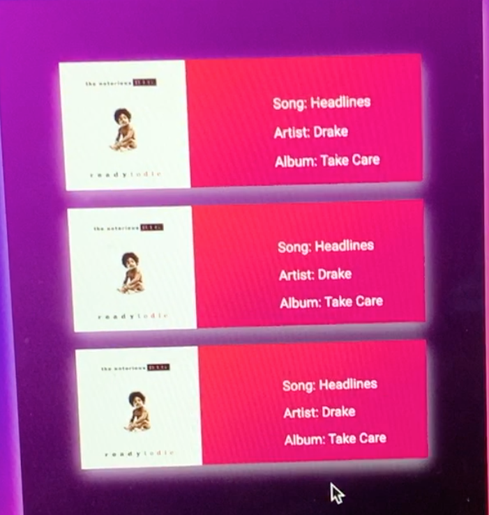

# Juniors Spring Intensive Deliverable Proposal

## TODO: copy this file, fill it out, and push it up to your project's repo.

Dates 3/16-3/25

**My Name:** 
Farhan Begg, Shaan Hurley, Youssef Sawiris

**Project Name:** 
DjTec

**Is your project New or Old?**
New

**Is your project Solo or Team?**

Team
## Description

**DjTec is a web app that allows users to see the next song the DJ is going to play, and the users can vote songs up or down to let the dj know what to play next**

## Challenges I Anticipate

**Connecting back-end and front-end. Implementing the spotify api, and user authentication for dj and users.**

## Skateboard

**ONE SINGLE aspect of product. Consider: build backend for SPD 1.2 front end, CRUD one resource, use API or library, authentication etc.**

**Start coding and finish “Skateboard” feature before beginning “Bike”.** 
Login for Dj, implement passport api, crud music playlist

## Bike
**ONE additional features that get you closer to your idealized product. Examples: CRUD 2nd resource, add comments, API use, authentication, library use** 
Responsive front-end, crud accounts, implement spotify api
## Car
**ONE additional feature** 
CRUD accounts using MAC addresses, QR code scanner

## Personal Achievement Goals:

**Each teammate must achieve 2 of 3 of their self-set personal achievement goals. If you're not on a team, delete the other teammate sections as needed.**

### Teammate 1: Farhan Begg

Implement CRUD Scroll Feed, List of music
Responsive Design
Implement the ability to vote on a song
Ability to search for songs
Designing users perspective U.I.
### Teammate 2: Shaan Hurley
1. Design user interface for Dj
1. Design view for Dj searching songs
1. Design Dj queue list and user song request

### Teammate 3: Youssef Sawiris
Use the Passport.js  api to allow DJ’s to sign in to their Spotify  
Code routes to add songs to a DJs queue 
Code the backend to allow users to vote song up/down depending on preference

## Wireframes

## Evaluation

**You must meet the following criteria in order to pass the intensive:**

- Students must get proposal approved before starting the project to pass
- SOLO 
    - must score an average above a 2.5 on the [rubric]
- TEAM 
    - Must score an average above 3 on the [rubric]
    - Each individual completes 2 of the 3 personal achievement goals from their proposal
- Pitch your product

[rubric]:https://docs.google.com/document/d/1IOQDmohLBEBT-hyr-2vgw1mbZUNsq3fHxVfH0oRmVt0/edit

## Approval Checklist
- [ ] If I have a team project, I wrote this proposal to represent my work and only my work
- [ ] I have completed all the necessary parts of this proposal
- [ ] I linked my proposal in the Spring Intensive Tracker

### Sign off

**Student Name:**                
> Name / Date
**Make School Advisor Name**
> TBD